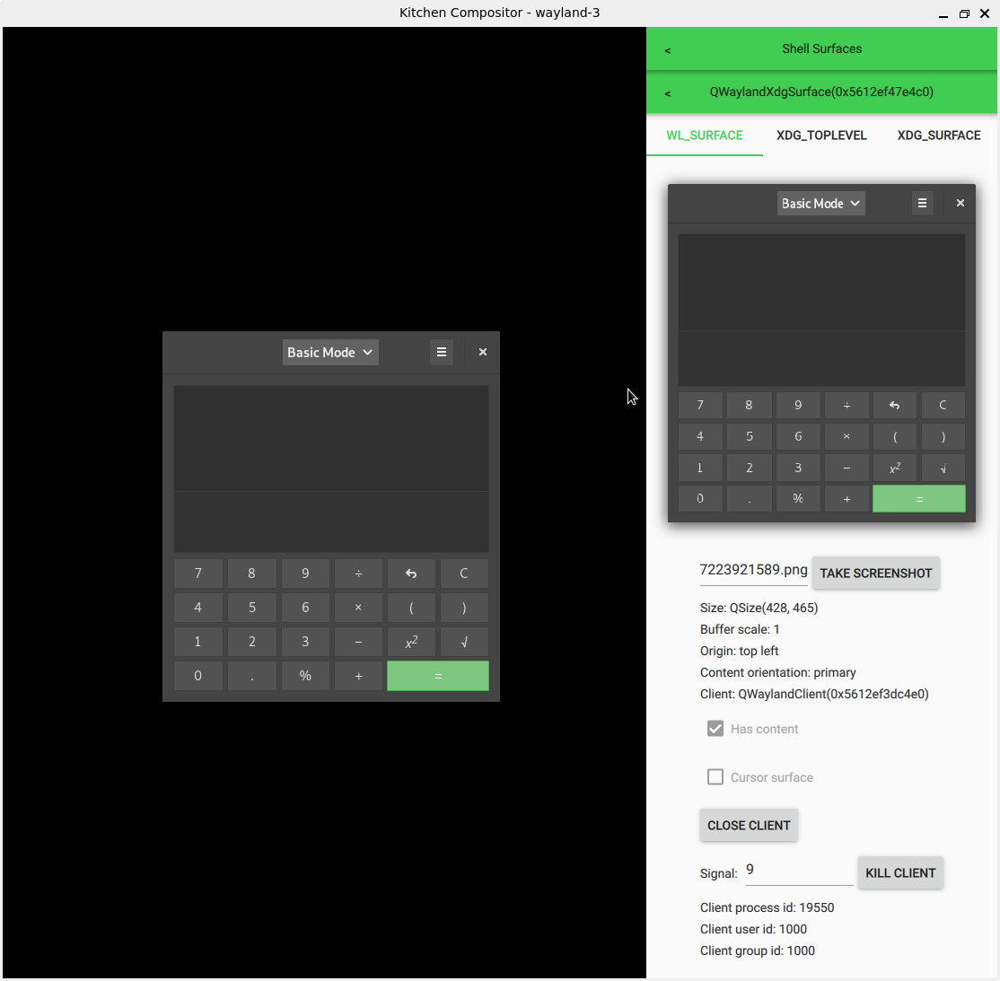

# Kitchen compositor

Wayland compositor for manual testing. Let's you easily inspect and send events to clients.

## Features

- wl\_surfaces:
  - Save screenshots
  - Inspect size, buffer scale, origin, orientation
- xdg\_toplevel:
  - Inspect app id, max/min size, parent, states
  - Send custom configure events
- xdg\_surface: inspect window geometry
- wl\_output: set custom physical size, resolution, scale factor, model, manufacturer, transform and subpixel format.
- wl\_touch: send fake touch events using the mouse

## Dependencies

- Qt 5.12 or newer with:
  - QtBase
  - QtDeclarative
  - QtWayland
